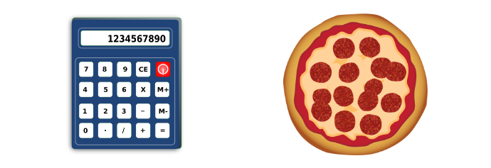
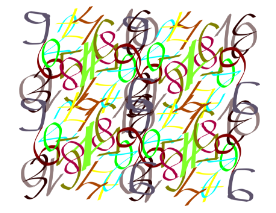

# 如何撸出一手好代码？

*原题：[C# BAD PRACTICES: Learn how to make a good code by bad example](http://www.codeproject.com/Articles/1083348/Csharp-BAD-PRACTICES-Learn-how-to-make-a-good-code)*

*作者：[Radosław Sadowski](http://www.codeproject.com/script/Membership/View.aspx?mid=10986471)，Microsoft Certified Software Developer*

[TOC]

## 介绍

我是微软认证软件开发者 Radoslaw Sadowski，自打我开始工作我就使用微软技术。

经过多年的工作，我发现身边人写的糟糕代码简直到了罄竹难书的地步，以至我都出现了代码洁癖。

写这篇文章是为了通过一些糟糕代码的例子和大家探讨如何去编写整洁的、可扩展的和可维护的代码。我在后面会解释糟糕代码会带来哪些麻烦问题，并介绍如何通过使用良好实践（good practices）和设计模式（design patterns）来应对这种局面。

第一部分是写给刚入门的 C# 开发者，演示一些基础错误以及一些关于提高代码可读性的技术。高级部分主要针对至少掌握设计模式的那些开发者，内容涉及完全整洁的可单元测试的代码。

为理解本文，你至少需要了解这些知识：

- C# 语言
- 依赖注入（dependency injection）、工厂方法（factory method）和策略设计模式（strategy design patterns）

​本文描述的例子都是具体的、三次元世界的功能，当然我也不会拿装饰模式（decorator pattern）来做披萨饼或是用策略模式（strategy pattern）来实现计算器，对不 :smile: :)

 


As those theoretical examples are very good for explanation I found extremely difficult to use it in a real production applications.


由于这些理论的例子是非常好的解释，我发现极难在实际生产应用中使用它。


We hear many times don't use **this** and use **that** instead. But why? I will try to explain it and prove that all the good practices and design patterns are really saving our lives!

**Note:**

- I will not explain C# language features and design patterns (it would make this article too long), there are so many good theoretical examples in the network.  I will concentrate to show how to use it in our ever day work
- Example is extremely simplified to highlight only described issues – I’ve found difficulties in understanding a general idea of article when I was learning from examples which were containing tones of code.
- I’m not saying that shown by me solutions for described below problems are the only one solutions, but for sure are working and making from your code high quality solution.
- I don't care in below code about error handling, logging etc. Code is written only to show solution for common programming problems.


Let’s go to concretes...


## 如何撸出一手渣代码？

Our real world example will be below class:

```
public class Class1
{
  public decimal Calculate(decimal amount, int type, int years)
  {
    decimal result = 0;
    decimal disc = (years > 5) ? (decimal)5/100 : (decimal)years/100; 
    if (type == 1)
    {
      result = amount;
    }
    else if (type == 2)
    {
      result = (amount - (0.1m * amount)) - disc * (amount - (0.1m * amount));
    }
    else if (type == 3)
    {
      result = (0.7m * amount) - disc * (0.7m * amount);
    }
    else if (type == 4)
    {
      result = (amount - (0.5m * amount)) - disc * (amount - (0.5m * amount));
    }
    return result;
  }
}
```

It is a really bad guy. Can we imagine what is the role of the above class? It is doing some wired calculating? That's all we can say about it for now…

Now imagine that it is a **DiscountManager** class which is responsible for calculating a discount for the customer while he is buying some product in online shop.

\- Come on? Really?
\- Unfortunately Yes!

It is completely unreadable, unmaintainable, unextendable and it is using many bad practices and anti-patterns.

What exact issues do we have here?

1. **Naming** – we can only guess what does this method calculate and what exactly is the input for these calculations. It is really hard to extract calculation algorithm from this class.
   Risks:
   the most important thing in this case is – time wasting

   <br />

   
   <br />

   , if we will get enquiry from business to present them algorithm details or we will have a need to modify this piece of code it will take us ages to understand logic of our **Calculate** method. And if we won’t document it or refactor the code, next time we/other developer will spend the same time to figure out what exactly is happening there. We can make very easily mistake while modifying it as well.

2. **Magic numbers**
   <br />
   
   <br />
   In our example the **type** variable means - status of the customer account. Could you guess that? **If-else if** statements make a choice how to calculate price of the product after discount.
   Now we don’t have an idea what kind of account is 1,2,3 or 4. Let’s imagine now that you have to change algorithm of giving discount for **ValuableCustomer** account You can try to figure out it from the rest of the code – what will take you a long time but even though we can very easily make a mistake and modify algorithm of **BasicCustomer** account – numbers like 2 or 3 aren’t very descriptive. After our mistake customers will be very happy because they will be getting a discount of valuable customers  😀 :)

3. **Not obvious bug** 
   Because our code is very dirty and unreadable we can easily miss very important thing. Imagine that there is a new customer account status added to our system - **GoldenCustomer**. Now our method will return 0 as a final price for every product which will be bought from a new kind of an account. Why? Because if none of our **if-else if** conditions will be satisfied (there will be unhandled account status) method will always return 0. Our boss is not happy – he sold many products for free before somebody realized that something is wrong.<br />
   ​
    

4. **Unreadable**
   We all have to agree that our code is extremely unreadable.
   Unreadable = more time for understanding the code + increasing risk of mistake.

5. **Magic numbers - again**
   Do we know what numbers like 0.1, 0.7, 0.5 mean? No we don't, but we should if we are owners of the code.
   Let’s imagine that you have to change this line:
   **result = (amount - (0.5m * amount)) - disc * (amount - (0.5m * amount));**
   ​
   as the method is completely unreadable you change only first 0.5 to 0.4 and leave second 0.5 as is. It can be a bug but it also can be a fully proper modification. It’s because 0.5 does not tell us anything.
   The same story we have in case of converting **years** variable to **disc** variable:
   **decimal disc = (years > 5) ? (decimal)5/100 : (decimal)years/100;**
   It is calculating discount for time of having account in our system in percentage. Ok, but what the hell is 5? It is a maximum discount in percentage which customer can get for loyalty. Could you guess that?

6. **DRY – Don’t repeat yourself** 
   It is not visible for the first look but there are many places in our method where the code is repeated.
   For example:
   **disc * (amount - (0.1m * amount));**
   ​
   is the same logic as:
   **disc * (amount - (0.5m * amount))**
   ​
   there is only static variable which is making a difference – we can easily parametrize this variable.
   If we won’t get rid of duplicated code we will come across situations where we will only do a part of task because we will not see that we have to change in the same way for example 5 places in our code. Above logic is calculating a discount for years of being a customer in our system. So if we will change this logic in 2 of 3 places our system will become inconsistent.

7. **Multiple responsibilities per class** 
   Our method has at least 3 responsibilities:

   1. Choosing calculation algorithm,
   2. Calculate a discount for account status,
   3. Calculate a discount for years of being our customer.

   It violates **Single Responsibility Principle**. What risk does it bring? If we will need to modify one of those 3 features it will affect also 2 other. It means that it could break something in features which we didn’t want to touch. So we will have to test all class again – **waste of time**.


## 开始重构……

In 9 below steps I will show you how we can avoid all described above risks and bad practices to achieve a clean, maintainable and unit testable code which will be readable like a book.

 

### I STEP – Naming, naming, naming

It's IMHO one of the most important aspect of a good code. We've only changed names of method, parameters and variables and now we exactly know what below class is responsible for.

```
public class DiscountManager
{
  public decimal ApplyDiscount(decimal price, int accountStatus, int timeOfHavingAccountInYears)
  {
    decimal priceAfterDiscount = 0;
    decimal discountForLoyaltyInPercentage = (timeOfHavingAccountInYears > 5) ? (decimal)5/100 : (decimal)timeOfHavingAccountInYears/100; 
    if (accountStatus == 1)
    {
      priceAfterDiscount = price;
    }
    else if (accountStatus == 2)
    {
      priceAfterDiscount = (price - (0.1m * price)) - (discountForLoyaltyInPercentage * (price - (0.1m * price)));
    }
    else if (accountStatus == 3)
    {
      priceAfterDiscount = (0.7m * price) - (discountForLoyaltyInPercentage * (0.7m * price));
    }
    else if (accountStatus == 4)
    {
      priceAfterDiscount = (price - (0.5m * price)) - (discountForLoyaltyInPercentage * (price - (0.5m * price)));
    }
 
    return priceAfterDiscount;
  }
}
```

However we still don't know what 1, 2, 3, 4 mean, let's do something with it!


### 第二步：魔法数

One of techniques of avoiding magic numbers in C# is replacing it by **enum**s. I prepared **AccountStatus** enum to replace our magic numbers in **if-else if** statements:

```
public enum AccountStatus
{
  NotRegistered = 1,
  SimpleCustomer = 2,
  ValuableCustomer = 3,
  MostValuableCustomer = 4
}
```

Now look at our refactored class, we can easily say which algorithm of calculating discount is used for which account status. Risk of mixing up Account Statuses decreased rapidly.

```
public class DiscountManager
{
  public decimal ApplyDiscount(decimal price, AccountStatus accountStatus, int timeOfHavingAccountInYears)
  {
    decimal priceAfterDiscount = 0;
    decimal discountForLoyaltyInPercentage = (timeOfHavingAccountInYears > 5) ? (decimal)5/100 : (decimal)timeOfHavingAccountInYears/100;
 
    if (accountStatus == AccountStatus.NotRegistered)
    {
      priceAfterDiscount = price;
    }
    else if (accountStatus == AccountStatus.SimpleCustomer)
    {
      priceAfterDiscount = (price - (0.1m * price)) - (discountForLoyaltyInPercentage * (price - (0.1m * price)));
    }
    else if (accountStatus == AccountStatus.ValuableCustomer)
    {
      priceAfterDiscount = (0.7m * price) - (discountForLoyaltyInPercentage * (0.7m * price));
    }
    else if (accountStatus == AccountStatus.MostValuableCustomer)
    {
      priceAfterDiscount = (price - (0.5m * price)) - (discountForLoyaltyInPercentage * (price - (0.5m * price)));
    }
    return priceAfterDiscount;
  }
}
```

### 第三步：提高可读性

In this step we will improve readability of our class by replacing **if-else if** statement with **switch-case** statement.

I also divided long one-line algorithms into two separate lines. We have now separated “calculation of discount for account status” from “calculation of discount for years of having customer account”.

For example, line:
**priceAfterDiscount = (price - (0.5m \* price)) - (discountForLoyaltyInPercentage * (price - (0.5m * price)));**

was replaced by:
**priceAfterDiscount = (price - (0.5m \* price));priceAfterDiscount = priceAfterDiscount - (discountForLoyaltyInPercentage * priceAfterDiscount);**

Below code presents described changes:

```
public class DiscountManager
{
  public decimal ApplyDiscount(decimal price, AccountStatus accountStatus, int timeOfHavingAccountInYears)
  {
    decimal priceAfterDiscount = 0;
    decimal discountForLoyaltyInPercentage = (timeOfHavingAccountInYears > 5) ? (decimal)5/100 : (decimal)timeOfHavingAccountInYears/100;
    switch (accountStatus)
    {
      case AccountStatus.NotRegistered:
        priceAfterDiscount = price;
        break;
      case AccountStatus.SimpleCustomer:
        priceAfterDiscount = (price - (0.1m * price));
        priceAfterDiscount = priceAfterDiscount - (discountForLoyaltyInPercentage * priceAfterDiscount);
        break;
      case AccountStatus.ValuableCustomer:
        priceAfterDiscount = (0.7m * price);
        priceAfterDiscount = priceAfterDiscount - (discountForLoyaltyInPercentage * priceAfterDiscount);
        break;
      case AccountStatus.MostValuableCustomer:
        priceAfterDiscount = (price - (0.5m * price));
        priceAfterDiscount = priceAfterDiscount - (discountForLoyaltyInPercentage * priceAfterDiscount);
        break;
    }
    return priceAfterDiscount;
  }
}
```

### IV STEP - Not obvious bug

We finally got to our hidden bug!

We finally got to our hidden bug!
As I mentioned before our method **ApplyDiscount **will return 0 as final price for every product which will be bought from new kind of account. Sad but true..

How can we fix it? By throwing **NotImplementedException**!

 

You will think - Isn't it exception driven development? No, it isn't!

When our method will get as parameter value of **AccountStatus** which we didn't support we want to be noticed immediately about this fact and stop program flow not to make any unpredictable operations in our system.

This situation **SHOULD NOT HAPPEN NEVER** so we have to throw exception if it will occur.

Below code was modified to throw an **NotImplementedException** if none conditions are satisfied – the **default** section of **switch-case** statement:

```
public class DiscountManager
{
  public decimal ApplyDiscount(decimal price, AccountStatus accountStatus, int timeOfHavingAccountInYears)
  {
    decimal priceAfterDiscount = 0;
    decimal discountForLoyaltyInPercentage = (timeOfHavingAccountInYears > 5) ? (decimal)5/100 : (decimal)timeOfHavingAccountInYears/100;
    switch (accountStatus)
    {
      case AccountStatus.NotRegistered:
        priceAfterDiscount = price;
        break;
      case AccountStatus.SimpleCustomer:
        priceAfterDiscount = (price - (0.1m * price));
        priceAfterDiscount = priceAfterDiscount - (discountForLoyaltyInPercentage * priceAfterDiscount);
        break;
      case AccountStatus.ValuableCustomer:
        priceAfterDiscount = (0.7m * price);
        priceAfterDiscount = priceAfterDiscount - (discountForLoyaltyInPercentage * priceAfterDiscount);
        break;
      case AccountStatus.MostValuableCustomer:
        priceAfterDiscount = (price - (0.5m * price));
        priceAfterDiscount = priceAfterDiscount - (discountForLoyaltyInPercentage * priceAfterDiscount);
        break;
      default:
        throw new NotImplementedException();
    }
    return priceAfterDiscount;
  }
}
```

### V STEP - Lets analyse calculations

In our example we have two criteria of giving a discount for our customers:

1. Account status
2. Time in years of having an account in our system.

All algorithms look similar in case of discount for time of being a customer:

All algorithms look similar in case of discount for time of being a customer:
**(discountForLoyaltyInPercentage \* priceAfterDiscount)**

,but there is one exception in case of calculating constant discount for account status:

,but there is one exception in case of calculating constant discount for account status:
**0.7m \* price**

so let's change it to look the same as in other cases:

so let's change it to look the same as in other cases:
**price - (0.3m \* price)**


```
public class DiscountManager
{
  public decimal ApplyDiscount(decimal price, AccountStatus accountStatus, int timeOfHavingAccountInYears)
  {
    decimal priceAfterDiscount = 0;
    decimal discountForLoyaltyInPercentage = (timeOfHavingAccountInYears > 5) ? (decimal)5/100 : (decimal)timeOfHavingAccountInYears/100;
    switch (accountStatus)
    {
      case AccountStatus.NotRegistered:
        priceAfterDiscount = price;
        break;
      case AccountStatus.SimpleCustomer:
        priceAfterDiscount = (price - (0.1m * price));
        priceAfterDiscount = priceAfterDiscount - (discountForLoyaltyInPercentage * priceAfterDiscount);
        break;
      case AccountStatus.ValuableCustomer:
        priceAfterDiscount = (price - (0.3m * price));
        priceAfterDiscount = priceAfterDiscount - (discountForLoyaltyInPercentage * priceAfterDiscount);
        break;
      case AccountStatus.MostValuableCustomer:
        priceAfterDiscount = (price - (0.5m * price));
        priceAfterDiscount = priceAfterDiscount - (discountForLoyaltyInPercentage * priceAfterDiscount);
        break;
      default:
        throw new NotImplementedException();
    }
    return priceAfterDiscount;
  }
}

```

Now we have all the rules which are calculating a discount according to account status in one format:

Now we have all the rules which are calculating a discount according to account status in one format:
**price - ((static_discount_in_percentages/100) \* price)**

### VI STEP - Get rid of magic numbers – another technique

Let's look at static variable which is a part of discount algorithm for account status:**(static_discount_in_percentages/100)**

and concrete instances of it:
0.1m
0.3m
0.5m

those numbers are very magic as well – they are not telling us anything about themselves.

We have the same situation in case of converting 'time in years of having an account' to discount a 'discount for loyalty:

**decimal discountForLoyaltyInPercentage = (timeOfHavingAccountInYears > 5) ? (decimal)5/100 : (decimal)timeOfHavingAccountInYears/100;**

number 5 is making our code very mysterious.
We have to do something with it to make it more descriptive!

I will use another technique of avoiding magic strings – which are **constants** (**const** keyword in C#). I strongly recommend to create one static class for constants to have it in one place of our application.

For our example, I've created below class:

```
public static class Constants
{
  public const int MAXIMUM_DISCOUNT_FOR_LOYALTY = 5;
  public const decimal DISCOUNT_FOR_SIMPLE_CUSTOMERS = 0.1m;
  public const decimal DISCOUNT_FOR_VALUABLE_CUSTOMERS = 0.3m;
  public const decimal DISCOUNT_FOR_MOST_VALUABLE_CUSTOMERS = 0.5m;
}
```

and after modification our **DiscountManager** class will look as below:

```
public class DiscountManager
{
  public decimal ApplyDiscount(decimal price, AccountStatus accountStatus, int timeOfHavingAccountInYears)
  {
    decimal priceAfterDiscount = 0;
    decimal discountForLoyaltyInPercentage = (timeOfHavingAccountInYears > Constants.MAXIMUM_DISCOUNT_FOR_LOYALTY) ? (decimal)Constants.MAXIMUM_DISCOUNT_FOR_LOYALTY/100 : (decimal)timeOfHavingAccountInYears/100;
    switch (accountStatus)
    {
      case AccountStatus.NotRegistered:
        priceAfterDiscount = price;
        break;
      case AccountStatus.SimpleCustomer:
        priceAfterDiscount = (price - (Constants.DISCOUNT_FOR_SIMPLE_CUSTOMERS * price));
        priceAfterDiscount = priceAfterDiscount - (discountForLoyaltyInPercentage * priceAfterDiscount);
        break;
      case AccountStatus.ValuableCustomer:
        priceAfterDiscount = (price - (Constants.DISCOUNT_FOR_VALUABLE_CUSTOMERS * price));
        priceAfterDiscount = priceAfterDiscount - (discountForLoyaltyInPercentage * priceAfterDiscount);
        break;
      case AccountStatus.MostValuableCustomer:
        priceAfterDiscount = (price - (Constants.DISCOUNT_FOR_MOST_VALUABLE_CUSTOMERS * price));
        priceAfterDiscount = priceAfterDiscount - (discountForLoyaltyInPercentage * priceAfterDiscount);
        break;
      default:
        throw new NotImplementedException();
    }
    return priceAfterDiscount;
  }
}
```

I hope you will agree that our method is now more self explanatory 😀 :)


###  第七步：不要让代码重复！

 

Just to not duplicate our code we will move parts of our algorithms to separate methods.

We will use extension methods to do that.

Firstly we have to create 2 extension methods:

```
public static class PriceExtensions
{
  public static decimal ApplyDiscountForAccountStatus(this decimal price, decimal discountSize)
  {
    return price - (discountSize * price);
  }
 
  public static decimal ApplyDiscountForTimeOfHavingAccount(this decimal price, int timeOfHavingAccountInYears)
  {
     decimal discountForLoyaltyInPercentage = (timeOfHavingAccountInYears > Constants.MAXIMUM_DISCOUNT_FOR_LOYALTY) ? (decimal)Constants.MAXIMUM_DISCOUNT_FOR_LOYALTY/100 : (decimal)timeOfHavingAccountInYears/100;
    return price - (discountForLoyaltyInPercentage * price);
  }
}
```

As names of our methods are very descriptive I don't have to explain what they are responsible for, now let's use the new code in our example:

```
public class DiscountManager
{
  public decimal ApplyDiscount(decimal price, AccountStatus accountStatus, int timeOfHavingAccountInYears)
  {
    decimal priceAfterDiscount = 0;
    switch (accountStatus)
    {
      case AccountStatus.NotRegistered:
        priceAfterDiscount = price;
        break;
      case AccountStatus.SimpleCustomer:
        priceAfterDiscount = price.ApplyDiscountForAccountStatus(Constants.DISCOUNT_FOR_SIMPLE_CUSTOMERS)
          .ApplyDiscountForTimeOfHavingAccount(timeOfHavingAccountInYears);
        break;
      case AccountStatus.ValuableCustomer:
        priceAfterDiscount = price.ApplyDiscountForAccountStatus(Constants.DISCOUNT_FOR_VALUABLE_CUSTOMERS)
          .ApplyDiscountForTimeOfHavingAccount(timeOfHavingAccountInYears);
        break;
      case AccountStatus.MostValuableCustomer:
        priceAfterDiscount = price.ApplyDiscountForAccountStatus(Constants.DISCOUNT_FOR_MOST_VALUABLE_CUSTOMERS)
          .ApplyDiscountForTimeOfHavingAccount(timeOfHavingAccountInYears);
        break;
      default:
        throw new NotImplementedException();
    }
    return priceAfterDiscount;
  }
}

```

Extension methods are very nice and can make your code simpler but at the end of the day are still static classes and can make your unit testing very hard or even impossible. Because of that we will get rid of it in the last step. I've used it just to present you how they can make our live easier, but I'm not a big fan of them.

Anyway, will you agree that our code looks a lot better now?

So let's jump to the next step!

### 第八步：移除多余的行

We should write as short and simple code as it is possible. Shorter code = less possible bugs, shorter time of understanding the business logic.

We should write as short and simple code as it is possible. Shorter code = less possible bugs, shorter time of understanding the business logic.
Let's simplify more our example then.

We can easily notice that we have the same mathod call for 3 kinds of customer account:

**.ApplyDiscountForTimeOfHavingAccount(timeOfHavingAccountInYears);**

Can't we do it once? No, we have exception for **NotRegistered** users because discount for years of being a registered customer does not make any sense for unregistered customer. True, but what time of having account has unregistered user?

\- 0 years

Discount in this case will always be 0, so we can safely add this discount also for unregistered users, let's do it!


```
public class DiscountManager
{
  public decimal ApplyDiscount(decimal price, AccountStatus accountStatus, int timeOfHavingAccountInYears)
  {
    decimal priceAfterDiscount = 0;
    switch (accountStatus)
    {
      case AccountStatus.NotRegistered:
        priceAfterDiscount = price;
        break;
      case AccountStatus.SimpleCustomer:
        priceAfterDiscount = price.ApplyDiscountForAccountStatus(Constants.DISCOUNT_FOR_SIMPLE_CUSTOMERS);
        break;
      case AccountStatus.ValuableCustomer:
        priceAfterDiscount = price.ApplyDiscountForAccountStatus(Constants.DISCOUNT_FOR_VALUABLE_CUSTOMERS);
        break;
      case AccountStatus.MostValuableCustomer:
        priceAfterDiscount = price.ApplyDiscountForAccountStatus(Constants.DISCOUNT_FOR_MOST_VALUABLE_CUSTOMERS);
        break;
      default:
        throw new NotImplementedException();
    }
    priceAfterDiscount = priceAfterDiscount.ApplyDiscountForTimeOfHavingAccount(timeOfHavingAccountInYears);
    return priceAfterDiscount;
  }
}
```

We were able to move this line outside the switch-case statement. Benefit – less code!

### 第九步：（高级）获得整洁的代码

All right! Now we can read our class like a book, but it isn't enough for us! We want super clean code now!

 

 Ok, so let's do some changes to finally achieve this goal. We will use **dependency injection** and **strategy** with a **factory** method design patterns!

 

That's how our code will look at the end of the day:


```
public class DiscountManager
{
  private readonly IAccountDiscountCalculatorFactory _factory;
  private readonly ILoyaltyDiscountCalculator _loyaltyDiscountCalculator;
 
  public DiscountManager(IAccountDiscountCalculatorFactory factory, ILoyaltyDiscountCalculator loyaltyDiscountCalculator)
  {
    _factory = factory;
    _loyaltyDiscountCalculator = loyaltyDiscountCalculator;
  }
 
  public decimal ApplyDiscount(decimal price, AccountStatus accountStatus, int timeOfHavingAccountInYears)
  {
    decimal priceAfterDiscount = 0;
    priceAfterDiscount = _factory.GetAccountDiscountCalculator(accountStatus).ApplyDiscount(price);
    priceAfterDiscount = _loyaltyDiscountCalculator.ApplyDiscount(priceAfterDiscount, timeOfHavingAccountInYears);
    return priceAfterDiscount;
  }
}
```


```
public interface ILoyaltyDiscountCalculator
{
  decimal ApplyDiscount(decimal price, int timeOfHavingAccountInYears);
}
 
public class DefaultLoyaltyDiscountCalculator : ILoyaltyDiscountCalculator
{
  public decimal ApplyDiscount(decimal price, int timeOfHavingAccountInYears)
  {
    decimal discountForLoyaltyInPercentage = (timeOfHavingAccountInYears > Constants.MAXIMUM_DISCOUNT_FOR_LOYALTY) ? (decimal)Constants.MAXIMUM_DISCOUNT_FOR_LOYALTY/100 : (decimal)timeOfHavingAccountInYears/100;
    return price - (discountForLoyaltyInPercentage * price);
  }
}
```


```
public interface IAccountDiscountCalculatorFactory
{
  IAccountDiscountCalculator GetAccountDiscountCalculator(AccountStatus accountStatus);
}
 
public class DefaultAccountDiscountCalculatorFactory : IAccountDiscountCalculatorFactory
{
  public IAccountDiscountCalculator GetAccountDiscountCalculator(AccountStatus accountStatus)
  {
    IAccountDiscountCalculator calculator;
    switch (accountStatus)
    {
      case AccountStatus.NotRegistered:
        calculator = new NotRegisteredDiscountCalculator();
        break;
      case AccountStatus.SimpleCustomer:
        calculator = new SimpleCustomerDiscountCalculator();
        break;
      case AccountStatus.ValuableCustomer:
        calculator = new ValuableCustomerDiscountCalculator();
        break;
      case AccountStatus.MostValuableCustomer:
        calculator = new MostValuableCustomerDiscountCalculator();
        break;
      default:
        throw new NotImplementedException();
    }
 
    return calculator;
  }
}
```


```
public interface IAccountDiscountCalculator
{
  decimal ApplyDiscount(decimal price);
}
 
public class NotRegisteredDiscountCalculator : IAccountDiscountCalculator
{
  public decimal ApplyDiscount(decimal price)
  {
    return price;
  }
}
 
public class SimpleCustomerDiscountCalculator : IAccountDiscountCalculator
{
  public decimal ApplyDiscount(decimal price)
  {
    return price - (Constants.DISCOUNT_FOR_SIMPLE_CUSTOMERS * price);
  }
}
 
public class ValuableCustomerDiscountCalculator : IAccountDiscountCalculator
{
  public decimal ApplyDiscount(decimal price)
  {
    return price - (Constants.DISCOUNT_FOR_VALUABLE_CUSTOMERS * price);
  }
}
 
public class MostValuableCustomerDiscountCalculator : IAccountDiscountCalculator
{
  public decimal ApplyDiscount(decimal price)
  {
    return price - (Constants.DISCOUNT_FOR_MOST_VALUABLE_CUSTOMERS * price);
  }
}
```


First of all we got rid of extension methods (read: static classes) because using them made caller class (**DiscountManager**) tightly coupled with discount algorithms inside extension methods. If we would want to unit test our**ApplyDiscount** method it would not be possible because we would be also testing **PriceExtensions** class.

 

To avoid it I've created **DefaultLoyaltyDiscountCalculator** class which contains logic of **ApplyDiscountForTimeOfHavingAccount** extension method and hide it’s implementation behind abstraction (read: interface) **ILoyaltyDiscountCalculator**. Now when we want to test our **DiscountManager** class we will be able to inject mock/fake object which implements **ILoyaltyDiscountCalculator** into our **DiscountManager** class via constructor to test only **DiscountManager** implementation. We are using here *Dependency Injection Design Pattern*.

 

 By doing it we have also moved responsibility of calculating a discount for loyalty to a different class, so if we will need to modify this logic we will have to change only **DefaultLoyaltyDiscountCalculator** class and all other code will stay untouched – lower risk of breaking something, less time for testing.

Below use of divided to separate class logic in our **DiscountManager** class:
**priceAfterDiscount = _loyaltyDiscountCalculator.ApplyDiscount(priceAfterDiscount, timeOfHavingAccountInYears);**

In case of calculation discount for account status logic, I had to create something more complex. We had 2 responsibilities which we wanted to move out from **DiscountManager**:

1. Which algorithm to use according to account status
2. Details of particular algorithm calculation

To move out first responsibility I’ve created a factory class (**DefaultAccountDiscountCalculatorFactory**) which is an implementation on *Factory Method Design Pattern* and hid it behind abstraction - **IAccountDiscountCalculatorFactory**.

 

 Our factory will decide which discount algorithm to choose. Finally we are injecting our factory into a **DiscountManager** class via constructor using *Dependency Injection Design Pattern*.

Below use of the factory in our **DiscountManager** class:
**priceAfterDiscount = _factory.GetAccountDiscountCalculator(accountStatus).ApplyDiscount(price);**

Above line will return proper strategy for particular account status and will invoke **ApplyDiscount** method on it.

First responsibility divided so let’s talk about the second one.

Let's talk about strategies then…

 

 As a discount algorithm could be different for every account status we will have to use different strategies to implement it. It’s great opportunity to use *Strategy Design Pattern*!

In our example we have now 3 strategies:

In our example we have now 3 strategies:
**NotRegisteredDiscountCalculator**
**SimpleCustomerDiscountCalculator**
**MostValuableCustomerDiscountCalculator**

They contain implementation of particular discount algorithms and are hidden behind abstraction:
**IAccountDiscountCalculator**.

It will allow our **DiscountManager** class to use proper strategy without knowledge of its implementation.**DiscountManager** only knows that returned object implements **IAccountDiscountCalculator** interface which contains method **ApplyDiscount**.

**NotRegisteredDiscountCalculator, SimpleCustomerDiscountCalculator, MostValuableCustomerDiscountCalculator** classes contain implementation of proper algorithm according to account status. As our 3 strategies look similar the only thing we could do more would be to create one method for all 3 algorithms and call it from each strategy class with a different parameter. As it would make our example to big I didn't decide to do that.

All right, so to sum up now we have a clean readable code and all our classes have only one responsibility – **only one reason to change**:
1. **DiscountManager** – manage code flow
2. **DefaultLoyaltyDiscountCalculator** – calculation of discount for loyalty
3. **DefaultAccountDiscountCalculatorFactory** – deciding which strategy of calculation account status discount to choose
4. **NotRegisteredDiscountCalculator**, **SimpleCustomerDiscountCalculator**, **MostValuableCustomerDiscountCalculator** – calculation of discount for account status

Now compare method from beginning:

```
public class Class1
{
    public decimal Calculate(decimal amount, int type, int years)
    {
        decimal result = 0;
        decimal disc = (years > 5) ? (decimal)5 / 100 : (decimal)years / 100;
        if (type == 1)
        {
            result = amount;
        }
        else if (type == 2)
        {
            result = (amount - (0.1m * amount)) - disc * (amount - (0.1m * amount));
        }
        else if (type == 3)
        {
            result = (0.7m * amount) - disc * (0.7m * amount);
        }
        else if (type == 4)
        {
            result = (amount - (0.5m * amount)) - disc * (amount - (0.5m * amount));
        }
        return result;
    }
}
```

to our new, refactored code:

```
public decimal ApplyDiscount(decimal price, AccountStatus accountStatus, int timeOfHavingAccountInYears)
{
  decimal priceAfterDiscount = 0;
  priceAfterDiscount = _factory.GetAccountDiscountCalculator(accountStatus).ApplyDiscount(price);
  priceAfterDiscount = _loyaltyDiscountCalculator.ApplyDiscount(priceAfterDiscount, timeOfHavingAccountInYears);
  return priceAfterDiscount;
}

```


## 结论

Presented in this article code is extremely simplified to make explanation of used techniques and patterns easier. It shows how common programming problems can be resolved in a dirty way and what are benefits of resolving it in a proper, clean way using good practices and design patterns.

In my work experience I saw many times highlighted in this article bad practices. They obviously exist in many places of application not in one class as in my example, which makes finding it even more difficult as they are hidden between proper code. People who are writing this kind of code always argue that they are following Keep It Simple Stupid rule. Unfortunately almost always systems are growing up and becoming very complex. Then every modification in this simple, unextendable code is very though and is bringing huge risk of breaking something.

Bare in mind that your code will live in a production environment for a long time and will be modified on every business requirement change. So writing too simple, unextendable code will have serious consequences very soon. And finally be nice for developers, who will maintain your code after yourself  😀 :)

If you have some questions according to article don't hesitate to contact me!

 

## 授权

This article, along with any associated source code and files, is licensed under [The Code Project Open License (CPOL)](http://www.codeproject.com/info/cpol10.aspx)

