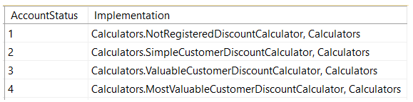

# 如何撸出一手好代码？（续）

*原题：[C# BAD PRACTICES: Learn how to make a good code by bad example – Part 2](http://www.codeproject.com/Articles/1097145/Csharp-BAD-PRACTICES-Learn-how-to-make-a-good-co)*

*作者：[Radosław Sadowski](http://www.codeproject.com/script/Membership/View.aspx?mid=10986471)，Microsoft Certified Software Developer*

[TOC]

## 介绍

列位，本文是我之前发表的[《如何撸出一手好代码？》](01-learn-how-to-make-a-good-code-by-bad-example.md)的续篇：


I strongly recommend to read it before you will start reading this one (I'll refer to it many times).

As I noticed that many people found my first article helpful I decided to write the second part of it.

So.. just to briefly recall what my first article was about. I showed there a few techniques which can be applied to the code to make it:

- More readable
- Better maintainable
- Extandable

I’ve showed it on an extremely simplified method – to avoid placing in the article tones of lines of code (many people –see comments - didn’t get the idea of the article and they thought that I’m trying to refactor extremely simplified method with a few lines of code), because I think it would make the article totally unreadable.

So to sum up I showed how to use a few techniques and design patterns which can make your and your colleagues from the company life easier when you have to implement complex application, which could potentially be extended and maintained for a long time.

I showed it on an simplified example which presents implementation of the real-world feature – Discount Calculator.


## 目标

 


In the previous article I’ve end up with a clean and maintainable solution.

However as many intelligent people noticed, **switch-case** statement in the factory below:


```
public class DefaultAccountDiscountCalculatorFactory : IAccountDiscountCalculatorFactory
{
  public IAccountDiscountCalculator GetAccountDiscountCalculator(AccountStatus accountStatus)
  {
    IAccountDiscountCalculator calculator;
    switch (accountStatus)
    {
      case AccountStatus.NotRegistered:
        calculator = new NotRegisteredDiscountCalculator();
        break;
      case AccountStatus.SimpleCustomer:
        calculator = new SimpleCustomerDiscountCalculator();
        break;
      case AccountStatus.ValuableCustomer:
        calculator = new ValuableCustomerDiscountCalculator();
        break;
      case AccountStatus.MostValuableCustomer:
        calculator = new MostValuableCustomerDiscountCalculator();
        break;
      default:
        throw new NotImplementedException();
    }
 
    return calculator;
  }
}
```

was still violating **Open/closed** principle. They suggested a few very good solutions. I totally agree with that and while writing the previous article I was planning to write the next one which will show how to fix this issue.

Previous article was very long and I decided to put it in the separate one as this topic is very complex and there are few ways of implementation.

So to sum up I will concentrate in this article on getting rid of switch-case statement from our abstract factory.

As in my opinion there is no one silver bullet to fix this issue for every cases, I decided to show a few versions of implementation and describe advantages and disadvantages of each.

Code of the factory will be our base code in this article.

Thank to the fact that we hid (in the previous article) implementation of the factory behind abstraction (interface):


```
public interface IAccountDiscountCalculatorFactory
{
  IAccountDiscountCalculator GetAccountDiscountCalculator(AccountStatus accountStatus);
}
```

we will be able to switch to a new implementation of the factory without touching any other classes.

We will only have to inject different implementation of the **IAccountDiscountCalculatorFactory** interface into the **DiscountManager** class or another caller if needed.

Isn't “programming to interface” approach great??!! Of course IT IS!

 


## Switch-case 语句 vs 字典模式

Why **switch-case** or multiple **if-else if** statements are a bad idea.

Well.. let's have a look at the below factory:

```
public class DefaultAccountDiscountCalculatorFactory : IAccountDiscountCalculatorFactory
{
  public IAccountDiscountCalculator GetAccountDiscountCalculator(AccountStatus accountStatus)
  {
    IAccountDiscountCalculator calculator;
    switch (accountStatus)
    {
      case AccountStatus.NotRegistered:
        calculator = new NotRegisteredDiscountCalculator();
        break;
      case AccountStatus.SimpleCustomer:
        calculator = new SimpleCustomerDiscountCalculator();
        break;
      case AccountStatus.ValuableCustomer:
        calculator = new ValuableCustomerDiscountCalculator();
        break;
      case AccountStatus.MostValuableCustomer:
        calculator = new MostValuableCustomerDiscountCalculator();
        break;
      default:
        throw new NotImplementedException();
    }
 
    return calculator;
  }
}
```

We have now 4 account statuses. Now imagine that our company is planning to add many more.

### First Problem

It means that every time we will add a support for a new status, we will have to modify our factory, by adding new **case** block. It means that every change can potentially introduce a bug in our class or can break existing unit tests.

### Second problem

Our factory is also tightly coupled with concrete implementations – it violates **Inversion of control** principle. We won't be able to replace an implementation of for example **SimpleCustomerDiscountCalculator** with **ExtandedSimpleCustomerDiscountCalculator** without the factory modification.

### More emphatic example

We can imagine situations where these issues will be better visible. If we will have a huge **switch-case** statement and every **case** block will be returning an instance of the class containing a specific business logic for the given country we can imagine that our **switch-case** statement will be extended every time we will want to handle a new one (of about 200 countries which exist in the world). After some time our **switch-case** statement will be huge and unreadable. There will be a risk to add the same country twice and so on.


## 理解对象的生命周期

 

Before I will start showing solutions for our problems I want to say a few words about life cycle of objects which we will be creating.

While implementing real-world solution we always have to consider how the life cycle of each object should look like with respect to the whole application.

As we don't need multiple instances of the factory (one instance can return objects for every call of every thread) we should create only one instance of it per application.

We can achieve it by using IOC container and configure it in a way that every call to our factory will return the same object. For an instance if we are using **AutoFac** library, it configuration will look as below:

```
var builder = new ContainerBuilder();
builder.RegisterType<DefaultAccountDiscountCalculatorFactory>().As<IAccountDiscountCalculatorFactory>().SingleInstance();
```

If we are injecting dependencies manually we have to create an instance once in the application root and inject the same instance to every component which will be using it. By the application root I mean for example **Main** method in case of the **Console application**.

 

In case of our calculators implementations such as:

- **NotRegisteredDiscountCalculator**
- **SimpleCustomerDiscountCalculator**
- etc.

the answer is not obvious.

 

There could be two ways of managing it:

- we want our factory to return **THE SAME** instance of **IAccountDiscountCalculator** implementation for every call
- we want our factory to return **A NEW** instance of **IAccountDiscountCalculator** implementation for each call


```
public class SimpleCustomerDiscountCalculator : IAccountDiscountCalculator
{
  private readonly IUser _user;
 
  public SetUser(IUser user)
  {
    _user = user;
  }
 
  public decimal ApplyDiscount(decimal price)
  {
  //business logic which is using _user field
  }
}
```

In the above class our state is a field: **_user**

If we are implementing multi-threaded application like **ASP MVC** project, we can't use one instance of above class for every call. Each thread will want to use **SimpleCustomerDiscountCalculator** class to operate on a different user. So we need to return a new instance of the **SimpleCustomerDiscountCalculator** class for every call to the factory.

I grouped my solutions into two groups:

- The factory returns **THE SAME** instance of the class for each call
- The factory returns **A NEW** instance of the class for each call


## 善用字典

In all suggested below solutions I will use **C# Dictionary** class. However I will use it in a different variants.

 

 Let's go now to the concrete implementations..

 


## 每次调用同一个实例

In this group of solutions, every call to the factory for a concrete implementation of **IAccountDiscountCalculator** for an instance:

```
_factory.GetAccountDiscountCalculator(AccountStatus.SimpleCustomer);

```

**will return the same object.**


### Basic Version

First version of my solution presents a simple factory:

```
public class DictionarableAccountDiscountCalculatorFactory : IAccountDiscountCalculatorFactory
{
    private readonly Dictionary<AccountStatus, IAccountDiscountCalculator> _discountsDictionary;
    public DictionarableAccountDiscountCalculatorFactory(Dictionary<AccountStatus, IAccountDiscountCalculator> discountsDictionary)
    {
        _discountsDictionary = discountsDictionary;
    }

    public IAccountDiscountCalculator GetAccountDiscountCalculator(AccountStatus accountStatus)
    {
        IAccountDiscountCalculator calculator;

        if (!_discountsDictionary.TryGetValue(accountStatus, out calculator))
        {
            throw new NotImplementedException("There is no implementation of IAccountDiscountCalculatorFactory interface for given Account Status");
        }

        return calculator;
    }
}
```

The factory above contains a dictionary of objects (calculators – implementations of the **IAccountDiscountCalculator**interface). It's a configuration of the factory.

When we will want to get an object from the factory it will return us an implementation assigned to **AccountStatus** enum value.

To make it work we have to configure the factory while creating it. As I mentioned before we only need a single instance of it and we will create this instance in the application root (if we want to inject it manually) or while creating IoC container.

So while creating our factory we need to create a configuration (assign each implementation to a choosen**AccountStatus**):

```
var discountsDictionary = new Dictionary<AccountStatus, IAccountDiscountCalculator>
      {
        {AccountStatus.NotRegistered, new NotRegisteredDiscountCalculator()},
        {AccountStatus.SimpleCustomer, new SimpleCustomerDiscountCalculator()},
        {AccountStatus.ValuableCustomer, new ValuableCustomerDiscountCalculator()},
        {AccountStatus.MostValuableCustomer, new MostValuableCustomerDiscountCalculator()}
      };
```

and inject it into the factory:

- manually:

```
var factory = new DictionarableAccountDiscountCalculatorFactory(discountsDictionary);

```

- or using IOC container (in this example I'm using - **AutoFac **library), here is the part responsible for our factory configuration:

```
var builder = new ContainerBuilder();
builder.RegisterType<DictionarableAccountDiscountCalculatorFactory>().As<IAccountDiscountCalculatorFactory>()
.WithParameter("discountsDictionary", discountsDictionary)
.SingleInstance();
```

Now, we are be able to use our factory, injected into the caller, in the same way as before (see previous article):

```
priceAfterDiscount = _factory.GetAccountDiscountCalculator(accountStatus).ApplyDiscount(price);

```

 

**Advantages:**

- It’s simple
- Strong-typed configuration – mistake in configuration (wrong type definition) will cause an error at the compile time
- Returning an objects from the factory is very fast -they are already created

**Disadvantages:**

- Won’t work in a multi-threaded environment when returned objects have a state

In my opinion this is the most suitable version for the feature we’re considering – **Simple Discount Calculator** example.

However I want to show how we can handle different situations…

### Lazy version

 

 Now imagine that creation of our calculators is very expensive. You have to load heavy files and then keep it in memory. But.. we will need to use only one calculator for an application instance…

How is it possible?

How is it possible?
For example, each user is running separate instance of **Windows Form application** and is performing discount calculation on the customers with one specific account status. Let's say Mary is performing calculations on the **Simple Customers** and Ted is performing calculations on the **Most Valuable Customers**. Then there won't be a need to create all calculators in each application instance.

To resolve this issue we can improve our factory by using **Lazy** type in **C#** which implements **Lazy Loading** pattern.

> **注意**
>
> **Lazy** type was introduced in **.NET Framework 4** version. If you are using older version on **.NET Framework**, you have to implement lazy loading manually.

Implementation of our factory will now look as below:

```
public class DictionarableLazyAccountDiscountCalculatorFactory : IAccountDiscountCalculatorFactory
{
    private readonly Dictionary<AccountStatus, Lazy<IAccountDiscountCalculator>> _discountsDictionary;
    public DictionarableLazyAccountDiscountCalculatorFactory(Dictionary<AccountStatus, Lazy<IAccountDiscountCalculator>> discountsDictionary)
    {
        _discountsDictionary = discountsDictionary;
    }

    public IAccountDiscountCalculator GetAccountDiscountCalculator(AccountStatus accountStatus)
    {
        Lazy<IAccountDiscountCalculator> calculator;

        if (!_discountsDictionary.TryGetValue(accountStatus, out calculator))
        {
            throw new NotImplementedException("There is no implementation of IAccountDiscountCalculatorFactory interface for given Account Status");
        }

        return calculator.Value;
    }
}
```

The factory configuration will change a little bit as well:

```
var lazyDiscountsDictionary = new Dictionary<AccountStatus, Lazy<IAccountDiscountCalculator>>
  {
    {AccountStatus.NotRegistered, new Lazy<IAccountDiscountCalculator>(() => new NotRegisteredDiscountCalculator()) },
    {AccountStatus.SimpleCustomer, new Lazy<IAccountDiscountCalculator>(() => new SimpleCustomerDiscountCalculator())},
    {AccountStatus.ValuableCustomer, new Lazy<IAccountDiscountCalculator>(() => new ValuableCustomerDiscountCalculator())},
    {AccountStatus.MostValuableCustomer, new Lazy<IAccountDiscountCalculator>(() => new MostValuableCustomerDiscountCalculator())}
  };
var factory = new DictionarableLazyAccountDiscountCalculatorFactory(lazyDiscountsDictionary);
```

Few words what we have done here..
Constructor of our lazy factory takes now as a parameter **Dictionary>** type and stores it in a private field.
​The dictionary will now use lazy **IAccountDiscountCalculator** implementations :smile: 
So while creating **lazyDiscountsDictionary** (configuration of the factory) to set a value of each item I'm using below syntax:

```
new Lazy<IAccountDiscountCalculator>(() => new NotRegisteredDiscountCalculator())
```

We are using a constructor of the **Lazy** class which takes a **Func** delegate as a parameter. When we will try to access the **Value** property of stored in our dictionary valuen (**Lazy** type) for the first time, this delegate will be executed and a concrete calculator implementation will be created.

The rest will look identically as in the first example.

Now the concrete calculator implementation will be created after the first request for it will be executed. Each next call for the same implementation will return the same (created while the first call) object.

Note that we still don’t have to change an interface **IAccountDiscountCalculator**. So we can use it in the caller class in the same way as for the Basic Version.

```
priceAfterDiscount = _factory.GetAccountDiscountCalculator(accountStatus).ApplyDiscount(price);
```

> **注意**
>
> Important thing is that you should decide if you really need to use lazy loading. Sometimes the basic version could be better – for example when you can accept the situation when the application start will take more time and you don’t want to delay returning an objects from the factory.

**Advantages:**

- Faster app start
- Doesn’t keep the object in memory until you really need it
- Strong-typed configuration – mistake in configuration (wrong type definition) will cause an error at the compile time

**Disadvantages:**

- First object return from the factory will be slower
- Won’t work in a multi-threaded environment when returned objects have a state

### Configuration outside the code

If you need or prefer to keep configuration of the factory (assignment of implementation to an enum value) outside the code base - this version will suit you.

We can store the configuration in the database table or in the configuration file whichever suits us better.

I will present an example when the configuration is stored in the database table and I will use **Entity Framework Code First** to get this configuration from the database and inject it into the factory.

Our factory implementation will look now as below:

```
public class ConfigurableAccountDiscountCalculatorFactory : IAccountDiscountCalculatorFactory
{
    private readonly Dictionary<AccountStatus, IAccountDiscountCalculator> _discountsDictionary;
    public ConfigurableAccountDiscountCalculatorFactory(Dictionary<AccountStatus, string> discountsDictionary)
    {
        _discountsDictionary = ConvertStringsDictToObjectsDict(discountsDictionary);
    }

    public IAccountDiscountCalculator GetAccountDiscountCalculator(AccountStatus accountStatus)
    {
        IAccountDiscountCalculator calculator;

        if (!_discountsDictionary.TryGetValue(accountStatus, out calculator))
        {
            throw new NotImplementedException("There is no implementation of IAccountDiscountCalculatorFactory interface for given Account Status");
        }

        return calculator;
    }

    private Dictionary<AccountStatus, IAccountDiscountCalculator> ConvertStringsDictToObjectsDict(
        Dictionary<AccountStatus, string> dict)
    {
        return dict.ToDictionary(x => x.Key,
            x => (IAccountDiscountCalculator)Activator.CreateInstance(Type.GetType(x.Value)));                
    }
}
```

 

You can notice that constructor of the factory takes now the dictionary of string values as a parameter:

```
Dictionary<AccountStatus,string>

```

and converts it to a dictionary of **IAccountDiscountCalculator** implementations:

```
Dictionary<AccountStatus,IAccountDiscountCalculator>
```

using private method:

```
private Dictionary<AccountStatus, IAccountDiscountCalculator> ConvertStringsDictToObjectsDict(
    Dictionary<AccountStatus, string> dict)
{
    return dict.ToDictionary(x => x.Key,
        x => (IAccountDiscountCalculator)Activator.CreateInstance(Type.GetType(x.Value)));                
}
```

 

Our configuration stored in the database table will look like this:

 

Convention of the string values is following the below pattern:

[Namespace].[ClassName], [AssemblyName]

Note that I keep **Account Statuses** as integer value as obviously the database does not support enum values.

You can also store your configuration in a config file (using the same notation).

 

Now we need to create our factory using configuration from the database:

```
var discountsDictionary = _repository.GetDiscountCalculatorConfiguration();
 
var factory = new ConfigurableAccountDiscountCalculatorFactory(discountsDictionary);
```

where the **GetDiscountCalculatorConfiguration** method in my Repository class looks as below:

```
public Dictionary<AccountStatus, string> GetDiscountCalculatorConfiguration()
{
    return _context.DiscountCalculatorConfigurationItems.ToDictionary(x => x.AccountStatus, x => x.Implementation);
}
```

The **DiscountCalculatorConfigurationItem** poco class will look as below:

```
public class DiscountCalculatorConfigurationItem
{
    [Key]
    public AccountStatus AccountStatus { get; set; }
    public string Implementation { get; set; }
}
```

The important thing is that I don’t have to map directly **integer** value from the database to an **enum** type! **Entity Framework** will do it for me! Isn’t it great? IT IS!

 

> **注意**
>
> Note that **EntityFramework** supports **enums** from version **5**!

If you’re not using EF under version 5 (old **EF**, **ADO.NET**, reading from the **config file**) you have to map **integer** to **enum**value for each item. However it is a very simple cast:

```
(YourEnum)yourIntVariable
```

I would do it in the private method of the factory:

**ConvertStringsDictToObjectsDict**

while converting input dictionary to a private one.

Note that we are still using our factory in the caller in the same way as before.

> **注意**
>
> Important: even if there won’t be an implementation of configured calculator the application will break when you’ll try to create the factory as the constructor is trying to instantiate all the calculators.
> So you won’t be able to run the application if there is a bug in your configuration.

When this approach can be useful? Look at our example.

Imagine that we have queueing system. We are sending messages to a queue. The message contains enough information to calculate a discount (account status among the others). We have also component which is subscribing to a queue, getting a message and calculating a discount.

We have a following Account Statuses in our system:

```
public enum AccountStatus
{
  NotRegistered = 1,
  SimpleCustomer = 2,
  ValuableCustomer = 3,
  MostValuableCustomer = 4,
  SimpleCustomerExtended = 5,
  ValuableCustomerExtended = 6,
  MostValuableCustomerExtended = 7
}
```

we have also 4 implementations of the **IAccountDiscountCalculator** interface:

- NotRegisteredDiscountCalculator
- SimpleCustomerDiscountCalculator
- ValuableCustomerDiscountCalculator
- MostValuableCustomerDiscountCalculator

The requirement is that our messages (with Account Status) INITIALLY should be handled by calculators as below:

- NotRegistered – NotRegisteredDiscountCalculator
- SimpleCustomer -  SimpleCustomerDiscountCalculator
- ValuableCustomer -  ValuableCustomerDiscountCalculator
- MostValuableCustomer -  MostValuableCustomerDiscountCalculator

But after some time we will need to add incrementally support for next statuses:
**Iteration 1:**
SimpleCustomerExtended – SimpleCustomerDiscountCalculator
**Iteration 2:**
ValuableCustomerExtended – ValuableCustomerDiscountCalculator
**Iteration 3:**
MostValuableCustomerExtended - MostValuableCustomerDiscountCalculator

The deployment process is very time consuming as the production server is running under a few nodes. We don't want to modify application code base in each iteration.

If we will have the factory configuration outside the code we will only have to change the database table or configuration file and restart the service. Now adding a support for those 3 Account Statuses one by one will be easier and faster.

**Advantages:**

- Configuration change does not mean change in a code base
- Switching assignment **AccountStatus** – **IAccountDiscountCalculatorFactory** implementation can be done via configuration

**Disadvantages:**

- Weak-typed configuration – mistake in a configuration (wrong type definition) will cause an error in the runtime
- Won’t work in a multi-threaded environment when returned objects have a state
- You potentially allow deployment team to change behaviour of your code

### Configuration in a separate source – Lazy version

If you need both: configuration outside the code base + lazy loading - this version is for you!

```
public class ConfigurableLazyAccountDiscountCalculatorFactory : IAccountDiscountCalculatorFactory
{
    private readonly Dictionary<AccountStatus, Lazy<IAccountDiscountCalculator>> _discountsDictionary;
    public ConfigurableLazyAccountDiscountCalculatorFactory(Dictionary<AccountStatus, Type> discountsDictionary)
    {
        _discountsDictionary = ConvertStringsDictToObjectsDict(discountsDictionary);
    }

    public IAccountDiscountCalculator GetAccountDiscountCalculator(AccountStatus accountStatus)
    {
        Lazy<IAccountDiscountCalculator> calculator;

        if (!_discountsDictionary.TryGetValue(accountStatus, out calculator))
        {
            throw new NotImplementedException("There is no implementation of IAccountDiscountCalculatorFactory interface for given Account Status");
        }

        return calculator.Value;
    }

    private Dictionary<AccountStatus, Lazy<IAccountDiscountCalculator>> ConvertStringsDictToObjectsDict(
        Dictionary<AccountStatus, Type> dict)
    {
      return dict.ToDictionary(x => x.Key,
          x => new Lazy<IAccountDiscountCalculator>(() => (IAccountDiscountCalculator)Activator.CreateInstance(x.Value)));                
    }
}
```

As you can see in the above code, I've changed the configurable factory from the previous version a little bit.

The type of the private dictionary have changed from:

```
Dictionary<AccountStatus, IAccountDiscountCalculator>

```

to:

```
Dictionary<AccountStatus, Lazy<IAccountDiscountCalculator>>

```

 

Another difference is that the constructor our factory takes now a parameter of type:

```
Dictionary<AccountStatus, Type>

```

so the configuration of the factory could now look like this:

```
var discountsDictionary = _repository.GetDiscountCalculatorConfiguration().ToDictionary(x=> x.Key, x => Type.GetType(x.Value));

```

 

Thank to this conversion:

```
Type.GetType(x.Value)

```

if we will make a mistake in the implementation type definition, an error will occur before the factory will be created. Fair play!

And the most important thing - **ConvertStringsDictToObjectsDict** method is now creating a lazy instances of the calculators:

```
new Lazy<IAccountDiscountCalculator>(() => (IAccountDiscountCalculator)Activator.CreateInstance(x.Value))

```

The **GetAccountDiscountCalculator** method returns now **Value **property of the dictionary value (**Lazy** type):

```
return calculator.Value;

```

 

**Advantages:**

- Configuration change does not mean change in a code base
- Faster app start
- Doesn’t keep the object in memory until you really need it
- Switching assignment **AccountStatus** – **IAccountDiscountCalculatorFactory** implementation can be done via configuration

**Disadvantages:**

- Weak-typed configuration – mistake in a configuration (wrong type definition) will cause an error in the runtime
- Won’t work in a multi-threaded environment when returned objects have a state
- You potentially allow deployment team to change behaviour of your code
- First object return from the factory will be slower


## 每次调用一个新实例

In this group of solutions, each call to the factory for the concrete implementation of **IAccountDiscountCalculator** - for an instance:

```
_factory.GetAccountDiscountCalculator(AccountStatus.SimpleCustomer);

```

**will return a new object.**

### Basic Version

First version of the factory in this group will look as below:

```
public class DictionarableAccountDiscountCalculatorFactory : IAccountDiscountCalculatorFactory
{
  private readonly Dictionary<AccountStatus, Type> _discountsDictionary;
  public DictionarableAccountDiscountCalculatorFactory(Dictionary<AccountStatus, Type> discountsDictionary)
  {       
    _discountsDictionary = discountsDictionary;
    CheckIfAllValuesFromDictImplementsProperInterface();
  }

  public IAccountDiscountCalculator GetAccountDiscountCalculator(AccountStatus accountStatus)
  {
    Type calculator;

    if (!_discountsDictionary.TryGetValue(accountStatus, out calculator))
    {
      throw new NotImplementedException("There is no implementation of IAccountDiscountCalculatorFactory interface for given Account Status");
    }

    return (IAccountDiscountCalculator)Activator.CreateInstance(calculator);
  }

  private void CheckIfAllValuesFromDictImplementsProperInterface()
  {
    foreach (var item in _discountsDictionary)
    {
      if (!typeof(IAccountDiscountCalculator).IsAssignableFrom(item.Value))
      {
        throw new ArgumentException("The type: " + item.Value.FullName + "does not implement IAccountDiscountCalculatorFactory interface!");
      }
    }
  }
}
```

You can notice that our private dictionary now keeps a **Type** type as a value:

```
private readonly Dictionary<AccountStatus, Type> _discountsDictionary;

```

Why?

 

 Because we want to instantiate an object of the type, assigned to the particular **AccountStatus** in the**GetAccountDiscountCalculator** method:

Hide   Copy Code

```
return (IAccountDiscountCalculator)Activator.CreateInstance(calculator);

```

**Type** type allows us to keep any type which exists in the application, in our case - implementations of the**IAccountDiscountCalculator**.

I'm using here C# **Activator** class to create a new object from the variable of the **Type** type.

You can see one more thing in the implementation of our factory:

```
private void CheckIfAllValuesFromDictImplementsProperInterface()
{
  foreach (var item in _discountsDictionary)
  {
    if (!typeof(IAccountDiscountCalculator).IsAssignableFrom(item.Value))
    {
      throw new ArgumentException("The type: " + item.Value.FullName + "does not implement IAccountDiscountCalculatorFactory interface!");
    }
  }
}
```

The method if executed from the constructor while the factory is created.

> **注意**
>
> I've added this check to the code because our factory is trying to make an instance of each calculator implementation and cast it to an **IAccountDiscountCalculator** interface. If we will configure an calculator implementation which does not implement **IAccountDiscountCalculator**, we will get an error when the factory will try to cast an instance of this calculator to an interface (while returning objects). We don't want it! Now if this situation will take place we will be noticed about it while the factory will be creating.

The last thing is the configuration of injected dictionary:

```
var discountsDictionary = new Dictionary<AccountStatus, Type>
            {
              {AccountStatus.NotRegistered, typeof(NotRegisteredDiscountCalculator)},
              {AccountStatus.SimpleCustomer, typeof(SimpleCustomerDiscountCalculator)},
              {AccountStatus.ValuableCustomer, typeof(ValuableCustomerDiscountCalculator)},
              {AccountStatus.MostValuableCustomer, typeof(MostValuableCustomerDiscountCalculator)}
            };
```

So to sum up, every time we will call the **GetAccountDiscountCalculator** method, the factory will return a new object assigned (in the injected dictionary) to the **AccountStatus**.

 

**Advantages:**

- It’s simple
- Strong-typed configuration – mistake in configuration (wrong type definition) will cause an error at the compile time
- Works like a charm in a multi-threaded environment when returned objects have a state

**Disadvantages:**

- Objects are returned slower from the factory - every call to the factory for an object will create a new instance
- If given in configuration type does not implement **IAccountDiscountCalculator** , an error will occur in the runtime
- Caller is responsible for managing a life cycle of an object after factory will return it

### Configuration outside the code

This version presents a factory which will return a new object per each call and have a configuration stored outside the code – this time in a **configuration file**.

Let's start this time from the **configuration file**:

```
<?xml version="1.0" encoding="utf-8" ?>
<configuration>
  <configSections>
    <section name="DiscountCalculatorsConfiguration" type="System.Configuration.NameValueSectionHandler" />
  </configSections>
  <DiscountCalculatorsConfiguration>
    <add key="NotRegistered" value="Calculators.NotRegisteredDiscountCalculator, Calculators" />
    <add key="SimpleCustomer" value="Calculators.SimpleCustomerDiscountCalculator, Calculators" />
    <add key="ValuableCustomer" value="Calculators.ValuableCustomerDiscountCalculator, Calculators" />
    <add key="MostValuableCustomer" value="Calculators.MostValuableCustomerDiscountCalculator, Calculators" />
  </DiscountCalculatorsConfiguration>
</configuration>
```

I've created a custom section and named it **DiscountCalculatorsConfiguration**.
Inside the section we have a collection of **key-value** pairs – definition of our factory (the same convention as in case of configuration stored in the database).
Now we just need to run this code before we will create the factory:

```
var collection = ConfigurationManager.GetSection("DiscountCalculatorsConfiguration") as NameValueCollection;
var discountsDictionary = collection.AllKeys.ToDictionary(k => k, k => collection[k]);
```

and inject created dictionary into our new factory:

```
public class ConfigurableAccountDiscountCalculatorFactory : IAccountDiscountCalculatorFactory
{
  private readonly Dictionary<AccountStatus, Type> _discountsDictionary;
  public ConfigurableAccountDiscountCalculatorFactory(Dictionary<string, string> discountsDictionary)
  {
    _discountsDictionary = ConvertStringsDictToDictOfTypes(discountsDictionary);
    CheckIfAllValuesFromDictImplementsProperInterface();
  }

  public IAccountDiscountCalculator GetAccountDiscountCalculator(AccountStatus accountStatus)
  {
    Type calculator;

    if (!_discountsDictionary.TryGetValue(accountStatus, out calculator))
    {
        throw new NotImplementedException("There is no implementation of IAccountDiscountCalculatorFactory interface for given Account Status");
    }

    return (IAccountDiscountCalculator)Activator.CreateInstance(calculator);
  }

  private void CheckIfAllValuesFromDictImplementsProperInterface()
  {
    foreach (var item in _discountsDictionary)
    {
      if (!typeof(IAccountDiscountCalculator).IsAssignableFrom(item.Value))
      {
        throw new ArgumentException("The type: " + item.Value.FullName + " does not implement IAccountDiscountCalculatorFactory interface!");
      }
    }
  }

  private Dictionary<AccountStatus, Type> ConvertStringsDictToDictOfTypes(
      Dictionary<string, string> dict)
  {
    return dict.ToDictionary(x => (AccountStatus)Enum.Parse(typeof(AccountStatus), x.Key, true),
        x => Type.GetType(x.Value));
  }
}
```

Note that to handle created from configuration file dictionary, we had to prepare our factory to take

```
Dictionary<string, string>

```

as a parameter and convert it to:

```
Dictionary<AccountStatus, Type>

```

in:

```
private Dictionary<AccountStatus, Type> ConvertStringsDictToDictOfTypes(
    Dictionary<string, string> dict)
{
  return dict.ToDictionary(x => (AccountStatus)Enum.Parse(typeof(AccountStatus), x.Key, true),
      x => Type.GetType(x.Value));
}
```

method.

The **GetAccountDiscountCalculator** method looks the same as in the previous version.

> **注意**
>
> Note that even if we will make a mistake in configuration (while defining implementation type), error will occur while the factory will be created (in **ConvertStringsDictToDictOfTypes **method):
>
> ```
> Type.GetType(x.Value)
> ```


> **注意**
>
> If configured implementation of calculator does not implement **IAccountDiscountCalculator** interface, an error will occur while the factory will be created as well – see **CheckIfAllValuesFromDictImplementsProperInterface** method.

**Advantages:**

- Configuration change does not mean change in a code base
- Switching assignment **AccountStatus** – **IAccountDiscountCalculatorFactory** implementation can be done via configuration
- Works like a charm in a multi-threaded environment when returned objects have a state

**Disadvantages:**

- Weak-typed configuration – mistake in a configuration will cause an error in a runtime
- You potentially allow deployment team to change behaviour of your code
- Objects are returned slower from the factory - every call to the factory for an object will create a new instance
- Caller is responsible for managing a life cycle of an object after the factory will return it


## 结论

 

 In this article I've presented how I see solution for the problem which existed in my previous article - the factory was violating principals:

- **Open/closed** principle
- **Inversion of control** principle

The issue was caused by using **switch-case** statement. In this article I replaced it using dictionary approach. 
I've presented 6 versions of implementation of the factory which are covering many different cases you will come across (or already did) while working as a developer.

Very important thing is that thank to "programming to an interface" approach we didn't have to modify anything else than the factory implementation, because an interface of the factory is still the same and its caller can use it in the same way as before (in the previous article).

So to sum up we've end up with fully configurable system which is based on configuration in a code, database or configuration file. We can now easily switch between the factory implementations and concrete calculators implementations. We can also add a support for a new Account Statuses and add a new calculators implementations without modification of existing classes.

如果你在阅读时遇到了问题，请果断联系我！


## 授权

本文及相关源代码和文件，均依据 [The Code Project Open License (CPOL)](http://www.codeproject.com/info/cpol10.aspx) 授权。

